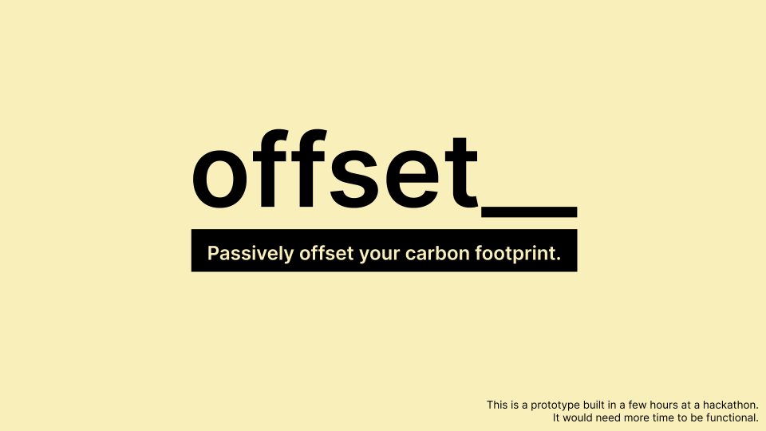

# offset__

Passively offset your carbon footprint.

## Inspiration

According to the Earth Institute at Columbia University, we need to remove 100 gigatons of carbon from the atmosphere to ["avert the most catastrophic effects of climate change"](https://blogs.ei.columbia.edu/2018/11/27/carbon-dioxide-removal-climate-change/). We need to reduce our emissions and offset whatever we can't reduce. Some ways to offset carbon footprints include:

* Funding sources of renewable energy 

* Capturing and burning greenhouse gases.

* Carbon sequestration 

[According to the NYTimes](https://www.nytimes.com/2019/07/24/climate/nyt-climate-newsletter-carbon-offsets.html), it can cost just $3.30 to offset one ton of carbon. There's some websites that let you purchase carbon offsets (e.g. carbonfund.org) but very few people know about them and even fewer contribute to them.

**What if there was a passive, easy way for all of us to offset our carbon footprints?**

[Link to the slides](https://docs.google.com/presentation/d/1Rt8BAFm09OosMFLESAYevZgseihiX2X7oQDhQTqW3O8/edit?usp=sharing)

## What it does

A chrome extension that will passively spend an additional 1% of every online purchase on offsetting your carbon footprint.

## How I built it

* Chrome extension

* [Vue](https://vuejs.org/)

* [Cloverly](https://cloverly.com/)

## Challenges I ran into

* Some of the sites I was using to test stopped loading (presumably because their network thought I was an attacker for refreshing the webpage too many times).

* CSS issues because the CSS of a content script is not isolated from the CSS in a web page

## Accomplishments that I'm proud of

This works on jet.com (online shopping) and aa.com (booking flights)

## What I learned

* An overview of browser extensions' architecture and affordances

* Learned about carbon offsets

## What's next for offset__

* Finish the payment stuff

* Make the extension work on multiple sites. Businesses could upload a offset.config.json file to their websites where the file would state the url of the checkout page and the id of the HTML element containing the order cost. The extension could make a request for this file for each site so that it could automatically grab the order cost _without_ having to hardcode anything.
